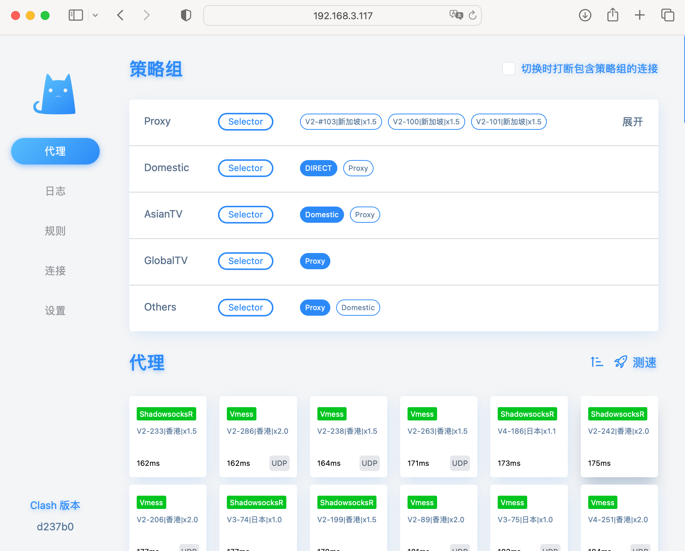

## Clash Deploy
```
$ sudo su
$ mkdir /opt/clash/ && cp ./* /opt/clash
$ cd /opt/clash
$ chmod +x clash

$ wget https://github.com/Dreamacro/maxmind-geoip/releases/download/20240212/Country.mmdb

$ wget  -O config.yaml YOUR_SUBSCRIBE_LINK
$ vi config.yaml # update  **external-ui** with /opt/clash/clash-dashboard/
```


## start Clash and auto-start on reboot
```
# star Clash
$ /opt/clash/clash -d /opt/clash
# auto-start
$ cp ./clash.service /etc/systemd/system/
$ systemctl enable clash
$ systemctl start clash
```

## auto update subscribe daily
```
$ apt-get install cron
$ vi update_clash_subscribe.sh  # update subscribe_url
$ cp update_clash_subscribe.sh /etc/cron/daily/update_clash_subscribe
```


## Usage
set HTTP/S proxy on device with IP_of_WieServer and 7890 port
to change node, visit address `http://localhost:9090/ui` in your web browser



## Update exeutable
Clash version is linux-arm64-v1.15.1, clash executable and clash-dashboard are offically not updated since 2023
For newer Country.mmdb, please refer to https://github.com/Dreamacro/maxmind-geoip/releases/ 
